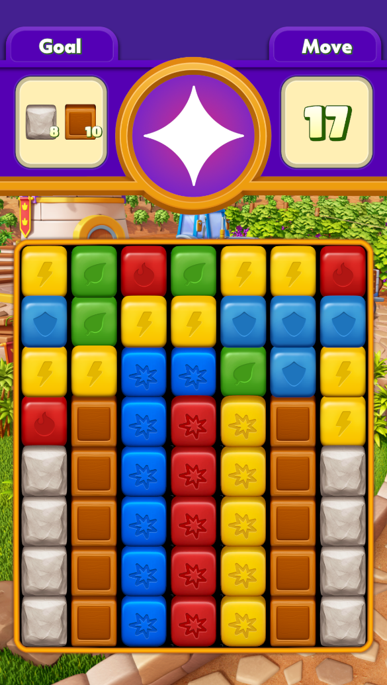

# BoomBlast - Unity Puzzle Game

(Make sure to set aspect ratio to 9:16 in the editor player.)
A level-based mobile puzzle game created with Unity 2022.3.8, featuring match-3 mechanics with special items and obstacles.

## Game Features

- Match-2+ puzzle gameplay with four cube colors
- Special TNT items that create explosive chain reactions
- Three types of obstacles: Box, Stone, and Vase
- 10 pre-designed levels with increasing difficulty
- Progress persistence between game sessions
- Portrait (9:16) orientation support

## Technical Requirements

- Unity 2022.3.8
- Built-in Renderer
- C#

## Getting Started

1. Clone the repository
2. Open the project in Unity 2022.3.8
3. Open the MainScene to start the game
4. Use the Editor menu items to adjust current level settings

## Gameplay Instructions

- Match 2 or more adjacent cubes of the same color
- Create TNTs by matching 5 or more cubes
- Clear all obstacles within the move limit to win
- TNT combinations create larger explosion areas
- Different obstacles require different strategies to clear:
  - Box: Cleared by adjacent matches or TNT
  - Stone: Only cleared by TNT explosions
  - Vase: Requires two hits to clear, falls vertically
